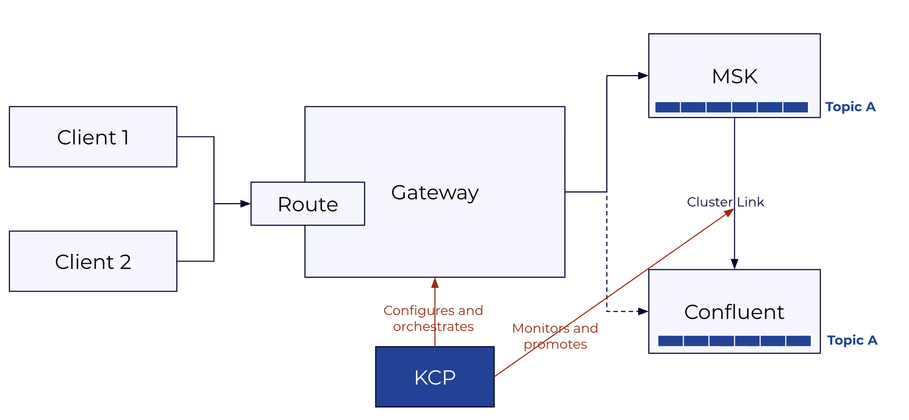
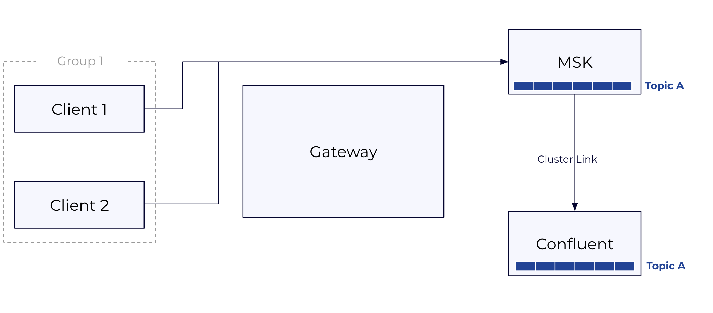
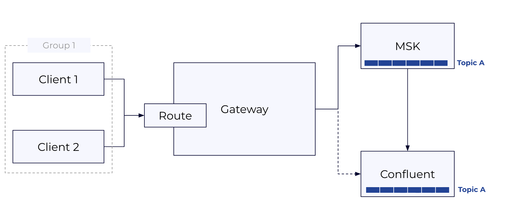
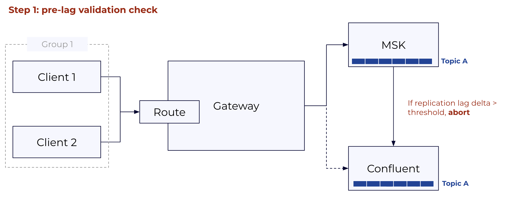
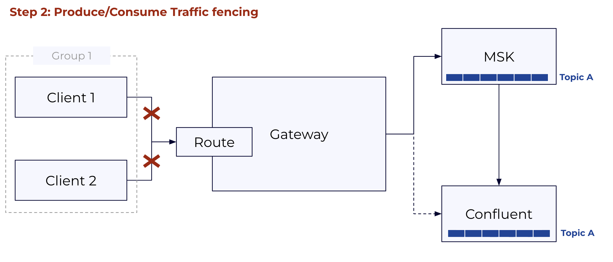
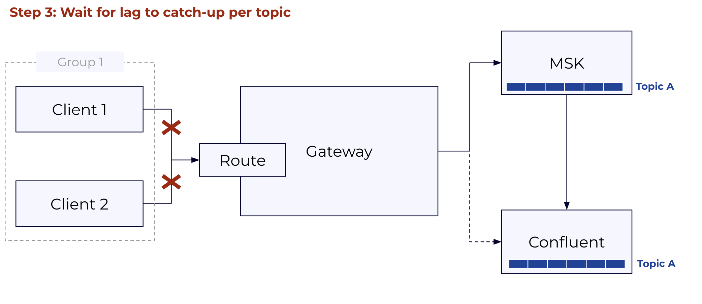
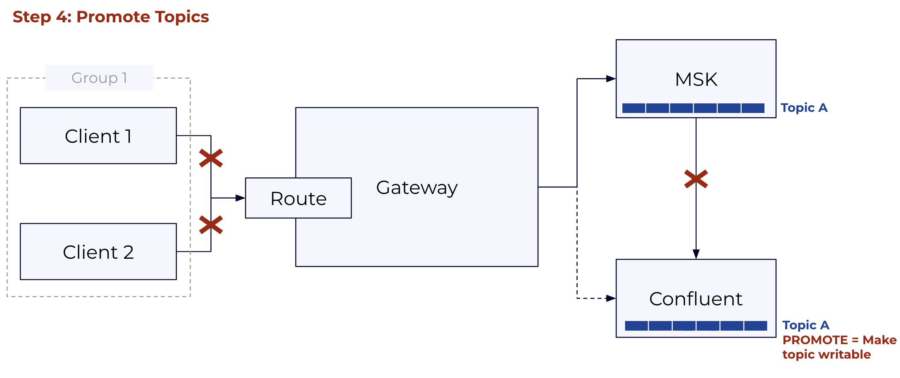
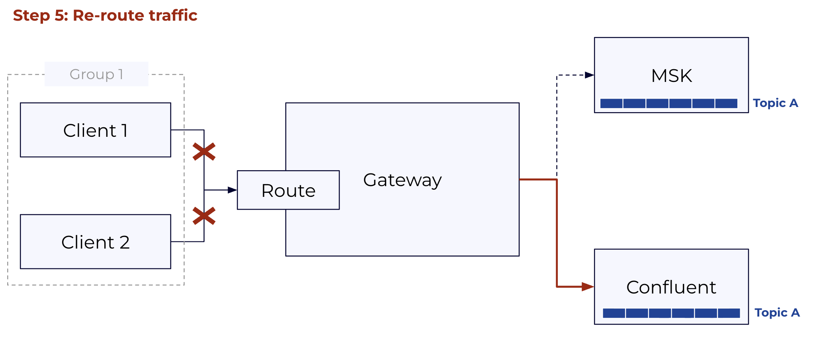
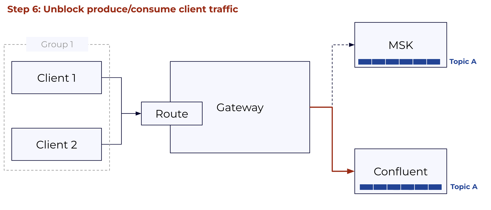

# Confluent Cloud Migration: KCP + Gateway Reference Guide

**Scope**: This document is a reference for the KCP + Gateway migration approach. It focuses specifically on the three KCP migration commands (`kcp migration init`, `kcp migration lag-check`, `kcp migration execute`) that orchestrate the client cutover. KCP's discovery and provisioning commands (`kcp scan`, `kcp create-asset`, etc.) are covered in the [KCP repository documentation](https://github.com/confluentinc/kcp/tree/main/docs) and are treated here as prerequisites. Covers component overview, licensing, infrastructure requirements, authentication support matrix, and operational guidance.

---

## 1. How This Works

The central idea: route all Kafka client traffic through a Kafka-aware proxy gateway deployed in (or adjacent to) the source cluster's network. The gateway forwards traffic to the source cluster while Cluster Linking replicates data to Confluent Cloud, then atomically flips to Confluent Cloud once replication lag is zero. Clients reconnect transparently with no code changes required.

Clients point at a stable gateway bootstrap URL for the entire migration. They don't know when the cutover happens. The gateway handles auth translation so clients can keep their existing source credentials until they're ready to update them. KCP orchestrates the full cutover sequence: pre-flight lag check, traffic block, topic promotion, route switch, unblock. It can resume from the last completed step if interrupted.

Migration scope is organized into groups. A group is any set of topics you define: one topic, a service boundary, an entire cluster. All topics in a group flip together in a single cutover. You control the scope of each cutover by how you define your groups. Two constraints to be aware of: clients using AWS IAM for MSK auth must pre-migrate to SASL/SCRAM or mTLS before onboarding to the gateway (see §5.2), and topic promotion via Cluster Linking is one-way. Rollback before promotion is fully supported; rollback after requires recreating the cluster link.

---

## 2. Components

There are three active components in the migration:

**KCP CLI** orchestrates the cutover through three commands: `kcp migration init` (validates setup and creates the migration plan), `kcp migration lag-check` (monitors replication lag), and `kcp migration execute` (runs the cutover). It runs from a local machine or bastion host and can be installed as a Confluent CLI plugin.

**CC Gateway** is a Kafka protocol proxy deployed in (or adjacent to) the source cluster's network. Clients connect to the gateway instead of the source cluster directly. The gateway forwards traffic to the source cluster during the migration window, handles auth translation between source credentials and Confluent Cloud credentials, and switches routing to Confluent Cloud at cutover, all without a restart. It is deployed on Kubernetes via Confluent for Kubernetes and requires a Confluent Platform license.

**Cluster Linking** runs in Confluent Cloud and replicates topics from the source cluster to the destination in real time, including consumer offset synchronization. At cutover, KCP triggers topic promotion once replication lag reaches zero. Cluster Linking is available on Dedicated and Enterprise cluster types.



**Prerequisites already in place:** Kubernetes (to host the gateway), a secret store (HashiCorp Vault, AWS Secrets Manager, or Azure Key Vault) to hold gateway backend credentials, and network connectivity between the gateway and both the source cluster and Confluent Cloud. KCP generates Terraform for any of these that need to be provisioned as part of the migration.

---

## 3. Licensing

**KCP CLI** is Apache 2.0 and free to use. Binaries are available for Linux, macOS (amd64/arm64), and Windows via GitHub Releases at [github.com/confluentinc/kcp](https://github.com/confluentinc/kcp). It can also be installed as a Confluent CLI plugin (`confluent plugin install kcp`), which lets it inherit existing Confluent CLI authentication and eliminates the need for separate API key flags.

**CC Gateway** requires a Confluent Cloud Gateway Add-On license. This is delivered as a Confluent license key (JWT) configured on the Gateway container via `GATEWAY_LICENSES`. The license is org-scoped: one license covers all Confluent Cloud clusters in a customer's org, with no per-node or per-cluster fees.

Without a license, the Gateway starts in trial mode, which supports up to 4 routes and is suitable for evaluation and testing. Production and at-scale deployments require the Add-On license to remove that limit.

For public product documentation, see the [Confluent Cloud Gateway Overview](https://docs.confluent.io/cloud/current/clusters/connect-self-managed-gateway/overview.html) in Confluent Docs.

---

## 4. Infrastructure Requirements

### 4.1 What Needs to Be in Place Before Running KCP

KCP expects three things to already exist and be reachable: the CC Gateway deployed in Kubernetes with Confluent for Kubernetes, a Confluent Cloud destination cluster (Dedicated or Enterprise) with Cluster Linking enabled, and a network path from wherever KCP runs to both the source cluster brokers and the CC REST API.

The gateway needs a stable DNS name that clients will use as their bootstrap address for the duration of the migration. This doesn't change at cutover, which is the whole point. The gateway also needs a TLS certificate that client trust stores already accept, network connectivity to source cluster brokers, and network connectivity to Confluent Cloud. Gateway backend credentials (the credentials it uses to authenticate to the source cluster and CC on behalf of clients) must be pre-loaded into your secret store (HashiCorp Vault, AWS Secrets Manager, or Azure Key Vault) before migration init.

KCP itself needs credentials to the source cluster's cloud provider in the standard credential chain and a kubeconfig pointing at the Kubernetes cluster hosting the gateway. Full permissions required are in §7.

### 4.2 Migration Infrastructure Types

For MSK clusters, when the source is not publicly accessible, KCP can provision the required migration infrastructure via `kcp create-asset migration-infra`. This covers four connectivity patterns:

For non-MSK clusters and full Cluster Linking configuration guidance, see the [Cluster Linking documentation](https://docs.confluent.io/cloud/current/multi-cloud/cluster-linking/index.html). For AWS MSK over private networking specifically, see [Cluster Linking with Private Networking](https://docs.confluent.io/cloud/current/multi-cloud/cluster-linking/private-networking.html).

---

## 5. Authentication Support Matrix

This is the most operationally complex part of the migration. There are three distinct auth boundaries, each configured independently:

1. **Client → Gateway**: how client applications authenticate to the gateway proxy.
2. **Gateway → Source**: how the gateway authenticates to the source cluster on the client's behalf.
3. **Gateway → CC**: how the gateway authenticates to Confluent Cloud after cutover.

The `--auth-mode` parameter in `kcp migration init` determines which direction uses passthrough vs. swap:
- `dest_swap` (default): clients present their **source credentials** to the gateway. Gateway passes these through to the source; gateway swaps them for CC credentials when routing to CC.
- `source_swap`: clients present their **CC credentials** to the gateway. Gateway passes these through to CC; gateway swaps them for source credentials when routing to the source.

### 5.1 Auth Combination Matrix

| Source auth | CC SASL/PLAIN | CC mTLS | CC OAuth |
|---|---|---|---|
| **IAM** | 🔴 Not supported | 🔴 Not supported | 🔴 Not supported |
| **mTLS** | 🟢 Supported, see §5.4 | 🟢 Supported, see §5.4 | 🟢 Supported, see §5.4 |
| **SASL/SCRAM** | 🟢 Supported, see §5.3 | 🔴 Not supported | 🟢 Supported, see §5.3 |
| **Unauthenticated** | 🟢 Supported | 🟢 Supported | 🟢 Supported |

Note: Confluent Cloud does not support SASL/SCRAM as a target protocol. When the source uses SCRAM, the gateway's auth swap translates client credentials to CC SASL/PLAIN (API key) or OAuth. This is handled transparently and requires no client changes.

Clients using AWS IAM must complete a pre-migration step to SASL/SCRAM or mTLS before onboarding to the gateway, see §5.2. All other auth types can onboard directly.

### 5.2 IAM Pre-Migration Path

IAM clients cannot connect to the gateway and must migrate to SCRAM or mTLS before the gateway onboarding step. This is a client configuration change (not a migration cutover) and happens before any KCP migration commands are run. The broad steps are:

1. Provision a corresponding SCRAM user in the source cluster for each IAM principal.
2. Update each client's auth config from `sasl.mechanism=AWS_MSK_IAM` to `sasl.mechanism=SCRAM-SHA-512` with the new SCRAM credentials. The bootstrap URL continues to point at the source cluster (or gateway, if they onboard directly).
3. Once all clients are confirmed on SCRAM, they can onboard to the gateway.

For MSK clusters, KCP provides tooling to accelerate this: `kcp scan clusters` discovers IAM principals from Kafka ACLs, and `kcp create-asset migrate-acls iam` generates Terraform for corresponding CC service accounts. These are out of scope for this document but are covered in the [KCP repository](https://github.com/confluentinc/kcp/tree/main/docs).

### 5.3 SASL/SCRAM: How the Gateway Handles It

SASL/SCRAM is not natively supported in Confluent Cloud. The gateway's auth swap makes this transparent: clients keep their existing SCRAM credentials throughout the migration, while the gateway maps them to CC credentials (SASL/PLAIN API key or OAuth token) stored in a secret store. No client configuration changes are required during the migration.

There are three ways to manage SCRAM credentials in the gateway:

- **Automatic management via Kafka admin API** (`alterScramCredentials: true`): The gateway creates and updates SCRAM user credentials directly through the Kafka admin API. No manual pre-population of the secret store is required. The gateway needs admin credentials with `AlterUserScramCredentials` and `DescribeUserScramCredentials` permissions on the source cluster.
- **SCRAM credentials in the auth swap secret store**: SCRAM verifiers are stored alongside the gateway-to-CC credential mappings in the same secret store (Vault, AWS Secrets Manager, etc.).
- **SCRAM credentials in a dedicated secret store**: SCRAM verifiers are stored in a separate secret store from other auth swap credentials, useful when your SCRAM store and your CC credential store are managed separately.

### 5.4 mTLS: How the Gateway Handles It

Identity passthrough cannot be used for mTLS because TLS terminates at the gateway. Auth swap is the only supported mode for mTLS clients. The gateway extracts the client's principal from the certificate CN/SAN using configured `principalMappingRules`, then opens a new connection to the source cluster using an ACM PCA-issued certificate with the same CN. The source cluster sees the same principal on both hops, so the gateway is transparent to the source cluster's ACL system and client ACLs continue to be enforced normally.

At cutover, the principal extracted from the cert is used to look up the corresponding CC credential in the secret store, and the gateway authenticates to CC on the client's behalf. If the CC target is mTLS, the gateway presents a certificate from its secret store; if SASL/PLAIN or OAuth, it swaps to the mapped credential.

Clients require no certificate changes or reconfiguration for any of these paths.

### 5.5 Credential Rotation and Secret Stores

The gateway supports HashiCorp Vault, AWS Secrets Manager, Azure Key Vault, and file-based secret stores for credential mappings. Because the gateway CR references credentials by secret name rather than by embedded value, rotation does not require a gateway restart or CR change. Update the secret in the store and the gateway picks it up on the next connection establishment.

One important configuration best practice from the official docs: each client should have its own gateway-to-broker credential. Mapping multiple clients to a single shared credential undermines the per-principal isolation the auth swap provides.

---

## 6. Cluster Linking

Cluster Linking must be configured before running any KCP migration commands. This includes the cluster link itself, mirror topics for all topics in the migration group, consumer offset sync enabled, and the link in a healthy replicating state. Configuring Cluster Linking is covered in the [Cluster Linking documentation](https://docs.confluent.io/cloud/current/multi-cloud/cluster-linking/index.html) and is out of scope here.

KCP's `kcp migration init` validates that Cluster Linking is correctly configured and will surface any issues before the cutover begins.


---

## 7. KCP Permissions Required

The following permissions are required specifically for the three migration commands (`kcp migration init`, `kcp migration lag-check`, `kcp migration execute`). Permissions for discovery and provisioning commands are documented in the [KCP repository](https://github.com/confluentinc/kcp/tree/main/docs).

**Confluent Cloud:**
- `CloudClusterAdmin` on the destination cluster: for cluster link operations (describe, list mirror topics, promote)
- `MetricsViewer`: for lag monitoring via the Confluent metrics API

**Kubernetes (for gateway CRD patching during cutover):**
- `get`, `patch`, `update` on `Gateway` resources in the gateway namespace
- Validate with: `kubectl auth can-i patch gateways -n confluent`

---

## 8. Client Experience During Cutover

When KCP blocks traffic on the gateway route (Step 2 of `kcp migration execute`), clients see:

- **Error code**: `BROKER_NOT_AVAILABLE` (standard Kafka error code 8)
- **Error message**: `"Migration to Confluent Cloud in progress. Your client will automatically retry. Expected completion: 60 seconds."`

This error code triggers **automatic retries in all standard Kafka clients** (Java, Python, Go, librdkafka). Producers buffer locally and retry. Consumers pause and retry fetch requests. No application code changes or client restarts are required.

Once KCP unblocks traffic (after all topics are promoted), the next retry from each client succeeds immediately, now writing to or reading from Confluent Cloud. From the application's perspective, this is indistinguishable from a temporary broker restart.

Clients should expect a brief partial downtime window of approximately 60 seconds. This covers two components: the gateway rolling restart that applies the routing change (typically a few seconds per pod), and any remaining replication lag that must drain before promotion completes. If Cluster Linking is fully caught up when the cutover starts, the lag drain time is negligible and the window is dominated by the gateway restart.

---

## 9. Known Constraints and Operational Guidance

**Cutover scope is per group, route, and topic set**: Each migration group corresponds to a gateway route and a set of topics that flip together. This means you control the scope of each cutover precisely by how you define your groups. A group scoped to a single service boundary affects only the topics in that service. Defining smaller, more carefully scoped groups reduces the impact of any single cutover.

**IAM clients require advance prep**: IAM clients must migrate to SCRAM or mTLS before gateway onboarding. Build this pre-migration step into the project timeline as it requires client-team coordination and application restarts.

**Consumer group offsets**: Consumer offset sync (`consumer.offset.sync.enable=true`) must be enabled on the cluster link before migration. Without it, consumers reconnecting after cutover may restart from an incorrect position. KCP validates this during `kcp migration init`. Post-cutover, consider stopping consumer offset sync for fully migrated consumer groups, as syncing stale offsets back from the source cluster after promotion serves no purpose.

**Gateway HA**: KCP patches gateway Kubernetes CRDs atomically across all gateway nodes. A gateway pod restart mid-cutover causes a brief client reconnection but does not lose data. A minimum of 2 gateway replicas (3 recommended) is the standard for production migrations.

**Cost during migration window**: Source cluster and CC run simultaneously during replication. Factor in the double-cost window for your migration timeline. `kcp report costs` gives you the source cluster baseline; `kcp create-asset target-infra` with appropriate sizing gives you the CC estimate.

**Rollback states**:
- Rollback after block but before any promotion: fully supported, safe. KCP unblocks and reverts the gateway CRD.
- Rollback after promotion: possible (no data loss) but the cluster link is broken. Requires recreating the cluster link and mirror topics from scratch. This is not automated.
- Rollback after unblock (traffic flowing to CC): not supported. Manual intervention required.

---

## 10. Client Migration Walkthrough

The cutover is three commands run in sequence. Everything else — gateway deployment, Cluster Linking setup, client onboarding to the gateway — must be in place beforehand.

KCP sits outside the data path. It configures and orchestrates the gateway (patching Kubernetes CRs to block, reroute, and unblock traffic) and monitors and promotes topics on the Cluster Link. Clients only ever talk to the gateway; they are unaware of KCP or the cutover happening underneath them.

### Prerequisites

Before running any `kcp migration` command, confirm the following are in place:

- **CC Gateway** deployed in Kubernetes, configured with two streaming domains (source cluster and CC), auth configured per §5, and clients already pointing at the gateway bootstrap URL
- **Cluster Linking** active: cluster link in CC, mirror topics replicating for all topics in the group, consumer offset sync enabled
- **KCP** has `CloudClusterAdmin` + `MetricsViewer` on the CC cluster and `get`/`patch`/`update` on the Gateway CR in Kubernetes



---

### Step 1: Prepare Gateway CRs

Before init, you need three gateway CR files ready on disk. The **initial CR** is your currently deployed gateway config — you reference it by name, KCP reads it from Kubernetes. The **fenced CR** is a modified version that blocks all traffic on the route and returns `BROKER_NOT_AVAILABLE` to clients. The **switchover CR** is another version that points the route at Confluent Cloud instead of the source cluster.

KCP does not generate these files. You author the fenced and switchover variants from your initial CR before running init, and pass their file paths to `kcp migration init`. Working examples for every supported auth combination are in the KCP repo at [`docs/switchover-*`](https://github.com/confluentinc/kcp/tree/main/docs).



---

### Step 2: `kcp migration init`

Run once per migration group. Init validates the entire setup before anything is changed: it confirms the cluster link is active, all topics in the group are replicating, the gateway CR exists and matches expectations, the fenced and switchover files parse correctly, and consumer offset sync is enabled. No traffic is affected at this step.

On success, KCP writes a `migration-state.json` file and prints a `migration-id`. That ID ties together all state for this group — you pass it to `lag-check` and `execute`. If KCP is installed as a Confluent CLI plugin, it inherits authentication from `confluent login` and the CC credential flags are not required.

Full flag reference: [`kcp migration init --help`](https://github.com/confluentinc/kcp/tree/main/docs#kcp-migration)

---

### Step 3: `kcp migration lag-check`

A live terminal UI that polls the Cluster Link REST API and shows per-topic replication lag in real time. Use it to judge when the group is ready to cut over. There is no rule for what "ready" means — it depends on your tolerance for the block window. Topics with large lag take longer to promote, so a group with one very high-lag topic extends the downtime window for all clients in that group.

```
TOPIC NAME    STATUS   TOTAL LAG   LAG TREND
demo-topic1   ACTIVE   115,779     ████████████████
demo-topic2   ACTIVE     9,718     ████████
demo-topic3   ACTIVE     9,503     ███████
```

Run it until lag is consistently near zero across all topics, then Ctrl+C and proceed.

Full flag reference: [`kcp migration lag-check --help`](https://github.com/confluentinc/kcp/tree/main/docs#kcp-migration)

---

### Step 4: `kcp migration execute`

Performs the cutover in four automatic phases. The operation is resumable: if interrupted at any point, re-running the same command picks up from the last completed phase.

| Phase | What KCP does | What clients see |
|---|---|---|
| **Pre-flight** | Re-checks lag against `--lag-threshold`; aborts if any topic exceeds it | Normal traffic |
| **Block** | Applies the fenced CR to the gateway; the route stops accepting produce/consume requests | `BROKER_NOT_AVAILABLE`; standard clients buffer and retry automatically |
| **Promote** | Promotes mirror topics one by one (lowest lag first), waiting for lag=0 per topic before each promotion | Still retrying; records buffered locally |
| **Switch + unblock** | Applies the switchover CR; gateway route now targets CC, traffic is unblocked | First retry succeeds; clients now on CC |

The total window from block to unblock is typically 30–90 seconds, dominated by lag drain on the highest-lag topic. If the Cluster Link is fully caught up before the block fires, the window is closer to the gateway rolling restart time (~60 seconds).

Steps:







Full flag reference: [`kcp migration execute --help`](https://github.com/confluentinc/kcp/tree/main/docs#kcp-migration)
