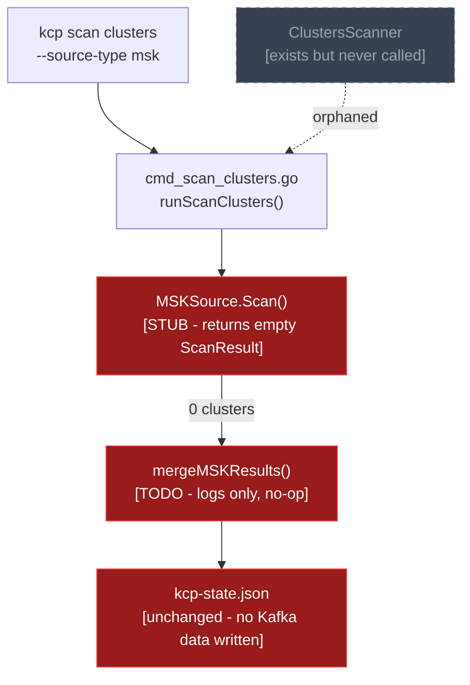
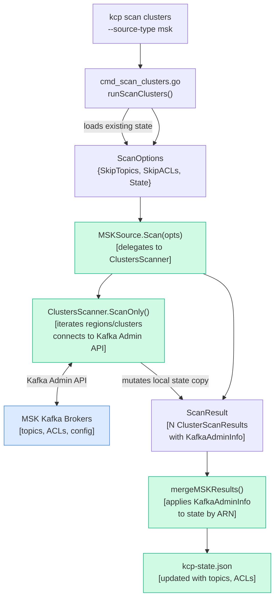

# MSK Scan Source Delegation Implementation Plan

> **For agentic workers:** REQUIRED: Use superpowers:subagent-driven-development (if subagents available) or superpowers:executing-plans to implement this plan. Steps use checkbox (`- [ ]`) syntax for tracking.

**Goal:** Wire MSK scanning through the `MSKSource.Scan()` method so that `kcp scan clusters --source-type msk` actually scans clusters instead of silently succeeding with 0 results.

**Architecture:** `ClustersScanner` (the existing MSK scan engine) will be refactored to expose a `ScanOnly()` method that runs the scan without persisting state. `MSKSource.Scan()` will delegate to this method, receive the results, and return them as a `ScanResult`. The `Source` interface's `ScanOptions` will carry the existing state (needed by MSK to look up broker addresses from AWS discovery data). `mergeMSKResults` in `cmd_scan_clusters.go` will update state with the scan output.

**Tech Stack:** Go, sarama (Kafka Admin API), cobra, testify

---

## Architecture: Before and After

### Before (broken state introduced by this PR)

`kcp scan clusters --source-type msk` routes through `MSKSource.Scan()`, which is a stub returning an empty result. `ClustersScanner` — the real MSK scan engine — exists but is never called. The command prints success and saves unchanged state.



### After (this plan)

`MSKSource.Scan()` delegates to `ClustersScanner.ScanOnly()`, which connects to the Kafka Admin API and scans topics/ACLs. Results flow back through `mergeMSKResults()` into state. `ClustersScanner` is no longer an orphan.



**Key structural change:** `ClustersScanner` gains a `ScanOnly()` method (scan without persist). `MSKSource.Scan()` creates a scanner, calls `ScanOnly()`, and translates the results. State is passed via `ScanOptions.State` because MSK broker addresses come from prior `kcp discover` output stored in state — the credentials file only has ARNs.

---

## Chunk 1: Fix Broken Tests and Refactor ClustersScanner

### Task 1: Fix broken `clusters_scanner_test.go`

The tests still use the old `State.Regions` top-level field, which was replaced by `State.MSKSources.Regions`. They don't compile.

**Files:**
- Modify: `cmd/scan/clusters/clusters_scanner_test.go`

- [ ] **Step 1: Run the tests to confirm they fail to compile**

```bash
go test ./cmd/scan/clusters/... 2>&1
```

Expected: build failure mentioning `unknown field Regions`.

- [ ] **Step 2: Update all `types.State{Regions: ...}` literals to use `MSKSources`**

In `clusters_scanner_test.go`, every `types.State{Regions: []types.DiscoveredRegion{...}}` must become:

```go
types.State{
    MSKSources: &types.MSKSourcesState{
        Regions: []types.DiscoveredRegion{...},
    },
}
```

There are 6 occurrences. Also update the two references to `tt.scanner.State.Regions` in `TestClustersScanner_getClusterFromDiscovery` — they become `tt.scanner.State.MSKSources.Regions`.

- [ ] **Step 3: Run tests to confirm they compile and pass**

```bash
go test ./cmd/scan/clusters/... -v -run TestClustersScanner 2>&1
```

Expected: all `TestClustersScanner_*` tests pass.

- [ ] **Step 4: Commit**

```bash
git add cmd/scan/clusters/clusters_scanner_test.go
git commit -m "fix(scan): update clusters_scanner_test.go to use MSKSources state schema"
```

---

### Task 2: Add `ScanOnly()` to `ClustersScanner`

Currently `Run()` scans and persists state in one step. We need to split these so `MSKSource` can call scan-only and handle persistence itself.

**Files:**
- Modify: `cmd/scan/clusters/clusters_scanner.go`

- [ ] **Step 1: Extract the scan loop from `Run()` into `ScanOnly()`**

In `clusters_scanner.go`, add a new method directly above `Run()`:

```go
// ScanOnly scans all clusters without persisting state or printing a summary.
// Call Run() instead if you want persistence and summary output.
func (cs *ClustersScanner) ScanOnly() error {
	for _, regionAuth := range cs.Credentials.Regions {
		for _, clusterAuth := range regionAuth.Clusters {
			if err := cs.scanCluster(regionAuth.Name, clusterAuth); err != nil {
				slog.Info("skipping cluster", "cluster", clusterAuth.Name, "error", err)
				continue
			}
		}
	}
	return nil
}
```

Then refactor `Run()` to delegate to `ScanOnly()`:

```go
func (cs *ClustersScanner) Run() error {
	if err := cs.ScanOnly(); err != nil {
		return err
	}

	if err := cs.State.PersistStateFile(cs.StateFile); err != nil {
		return fmt.Errorf("failed to save discovery state: %v", err)
	}

	if err := cs.outputExecutiveSummary(); err != nil {
		slog.Warn("failed to output executive summary", "error", err)
	}

	return nil
}
```

- [ ] **Step 2: Run the existing tests to confirm nothing is broken**

```bash
go test ./cmd/scan/clusters/... -v 2>&1
```

Expected: all tests pass (behaviour of `Run()` is unchanged).

- [ ] **Step 3: Commit**

```bash
git add cmd/scan/clusters/clusters_scanner.go
git commit -m "refactor(scan): extract ScanOnly() from ClustersScanner.Run() for use without persistence"
```

---

## Chunk 2: Thread State into ScanOptions and Implement MSKSource.Scan()

### Task 3: Add `State` to `ScanOptions`

MSK scanning needs the existing state to look up broker addresses that were populated by `kcp discover`. The cleanest way to pass it without changing the `Source` interface signature is to add an optional field to `ScanOptions`.

**Files:**
- Modify: `internal/sources/interface.go`
- Modify: `cmd/scan/clusters/cmd_scan_clusters.go`

- [ ] **Step 1: Add `State *types.State` to `ScanOptions`**

```go
// ScanOptions contains options for scanning
type ScanOptions struct {
	SkipTopics bool
	SkipACLs   bool
	// State is the existing kcp state. Required for MSK scanning (broker addresses
	// come from prior kcp discover output). Ignored by OSK.
	State *types.State
}
```

- [ ] **Step 2: Update `runScanClusters` in `cmd_scan_clusters.go` to populate `State`**

Find the `scanOpts` block and add the state field:

```go
scanOpts := sources.ScanOptions{
    SkipTopics: skipTopics,
    SkipACLs:   skipACLs,
    State:      state,
}
```

- [ ] **Step 3: Confirm the project still compiles**

```bash
go build ./... 2>&1
```

Expected: no errors. `OSKSource.Scan()` receives `opts.State` but ignores it — that is fine.

- [ ] **Step 4: Commit**

```bash
git add internal/sources/interface.go cmd/scan/clusters/cmd_scan_clusters.go
git commit -m "feat(sources): add State to ScanOptions for MSK scanning context"
```

---

### Task 4: Implement `MSKSource.Scan()`

**Files:**
- Modify: `internal/sources/msk/msk_source.go`
- Modify: `internal/sources/msk/msk_source_test.go`

- [ ] **Step 1: Write failing tests for the new `Scan()` error cases**

In `msk_source_test.go`, add:

```go
import (
    "context"
    "os"
    "path/filepath"
    "testing"

    "github.com/confluentinc/kcp/internal/sources"
    "github.com/confluentinc/kcp/internal/sources/msk"
    "github.com/confluentinc/kcp/internal/types"
    "github.com/stretchr/testify/assert"
    "github.com/stretchr/testify/require"
)

func TestMSKSource_Scan_ErrorWhenCredentialsNotLoaded(t *testing.T) {
    source := msk.NewMSKSource()
    state := &types.State{
        MSKSources: &types.MSKSourcesState{Regions: []types.DiscoveredRegion{}},
    }
    opts := sources.ScanOptions{State: state}

    _, err := source.Scan(context.Background(), opts)

    require.Error(t, err)
    assert.Contains(t, err.Error(), "credentials not loaded")
}

func TestMSKSource_Scan_ErrorWhenStateNotProvided(t *testing.T) {
    source := msk.NewMSKSource()

    content := "regions: []\n"
    tmpDir := t.TempDir()
    credFile := filepath.Join(tmpDir, "msk-credentials.yaml")
    require.NoError(t, os.WriteFile(credFile, []byte(content), 0644))
    require.NoError(t, source.LoadCredentials(credFile))

    opts := sources.ScanOptions{State: nil}

    _, err := source.Scan(context.Background(), opts)

    require.Error(t, err)
    assert.Contains(t, err.Error(), "state is required")
}

func TestMSKSource_Scan_EmptyResultWhenNoRegions(t *testing.T) {
    source := msk.NewMSKSource()

    content := "regions: []\n"
    tmpDir := t.TempDir()
    credFile := filepath.Join(tmpDir, "msk-credentials.yaml")
    require.NoError(t, os.WriteFile(credFile, []byte(content), 0644))
    require.NoError(t, source.LoadCredentials(credFile))

    state := &types.State{
        MSKSources: &types.MSKSourcesState{Regions: []types.DiscoveredRegion{}},
    }
    opts := sources.ScanOptions{State: state}

    result, err := source.Scan(context.Background(), opts)

    require.NoError(t, err)
    assert.Equal(t, types.SourceTypeMSK, result.SourceType)
    assert.Empty(t, result.Clusters)
}
```

- [ ] **Step 2: Run tests to confirm they fail**

```bash
go test ./internal/sources/msk/... -v -run TestMSKSource_Scan 2>&1
```

Expected: FAIL — current `Scan()` does not check state and returns empty result unconditionally.

- [ ] **Step 3: Check for circular import before implementing**

`MSKSource` lives in `internal/sources/msk`. `ClustersScanner` lives in `cmd/scan/clusters`. The `cmd` package imports from `internal`, but `internal` must not import from `cmd`. Check:

```bash
grep -r "^package" cmd/scan/clusters/clusters_scanner.go
```

If it is `package clusters` under `cmd/`, moving `ClustersScanner` to `internal/services/msk_scanner/` is required before implementing. See the Import Cycle Contingency section at the bottom of this plan.

- [ ] **Step 4: Implement `MSKSource.Scan()`**

Replace the stub in `msk_source.go`. If `ClustersScanner` was moved to `internal/services/msk_scanner/`, update the import path accordingly.

```go
func (s *MSKSource) Scan(ctx context.Context, opts sources.ScanOptions) (*sources.ScanResult, error) {
    if s.credentials == nil {
        return nil, fmt.Errorf("credentials not loaded")
    }
    if opts.State == nil {
        return nil, fmt.Errorf("state is required for MSK scanning; run 'kcp discover' first")
    }

    slog.Info("starting MSK cluster scan")

    scanner := clusters.NewClustersScanner(clusters.ClustersScannerOpts{
        State:       *opts.State,
        Credentials: *s.credentials,
    })

    if err := scanner.ScanOnly(); err != nil {
        return nil, fmt.Errorf("MSK scan failed: %w", err)
    }

    // Translate scanner results into ScanResult
    result := &sources.ScanResult{
        SourceType: types.SourceTypeMSK,
        Clusters:   make([]sources.ClusterScanResult, 0),
    }

    if scanner.State.MSKSources != nil {
        for _, region := range scanner.State.MSKSources.Regions {
            for i := range region.Clusters {
                cluster := &region.Clusters[i]
                // Only include clusters that were actually scanned
                if cluster.KafkaAdminClientInformation.ClusterID == "" {
                    continue
                }
                kafkaInfo := cluster.KafkaAdminClientInformation
                result.Clusters = append(result.Clusters, sources.ClusterScanResult{
                    Identifier: sources.ClusterIdentifier{
                        Name:     cluster.Name,
                        UniqueID: cluster.Arn,
                    },
                    KafkaAdminInfo:     &kafkaInfo,
                    SourceSpecificData: cluster.AWSClientInformation,
                })
            }
        }
    }

    slog.Info("MSK scan complete", "scanned", len(result.Clusters))
    return result, nil
}
```

- [ ] **Step 5: Run the new tests**

```bash
go test ./internal/sources/msk/... -v -run TestMSKSource_Scan 2>&1
```

Expected: all three tests pass.

- [ ] **Step 6: Confirm full build**

```bash
go build ./... 2>&1
```

Expected: no errors.

- [ ] **Step 7: Commit**

```bash
git add internal/sources/msk/msk_source.go internal/sources/msk/msk_source_test.go
git commit -m "feat(msk): implement MSKSource.Scan() by delegating to ClustersScanner.ScanOnly()"
```

---

## Chunk 3: Implement mergeMSKResults and Verify

### Task 5: Implement `mergeMSKResults`

Currently the function logs and returns nil. It must apply the scanned `KafkaAdminClientInformation` back into the state so it gets persisted.

**Files:**
- Modify: `cmd/scan/clusters/cmd_scan_clusters.go`

- [ ] **Step 1: Replace the stub with real merge logic**

```go
// mergeMSKResults merges MSK scan results into state
func mergeMSKResults(state *types.State, result *sources.ScanResult) error {
    if state.MSKSources == nil {
        return fmt.Errorf("no MSK sources in state; run 'kcp discover' before scanning MSK clusters")
    }

    // Index scanned results by ARN for O(1) lookup
    scannedByARN := make(map[string]*types.KafkaAdminClientInformation, len(result.Clusters))
    for i := range result.Clusters {
        c := &result.Clusters[i]
        scannedByARN[c.Identifier.UniqueID] = c.KafkaAdminInfo
    }

    // Apply results into state in-place
    for i := range state.MSKSources.Regions {
        for j := range state.MSKSources.Regions[i].Clusters {
            arn := state.MSKSources.Regions[i].Clusters[j].Arn
            if info, ok := scannedByARN[arn]; ok {
                state.MSKSources.Regions[i].Clusters[j].KafkaAdminClientInformation = *info
            }
        }
    }

    slog.Info("merged MSK scan results", "clusters_scanned", len(result.Clusters))
    return nil
}
```

- [ ] **Step 2: Run all tests**

```bash
go test ./cmd/scan/clusters/... -v 2>&1
```

Expected: all tests pass.

- [ ] **Step 3: Run the full test suite**

```bash
make build-frontend && go test ./... 2>&1
```

Expected: all tests pass (integration tests may be skipped without Docker — that is fine).

- [ ] **Step 4: Commit**

```bash
git add cmd/scan/clusters/cmd_scan_clusters.go
git commit -m "feat(scan): implement mergeMSKResults to persist Kafka Admin scan data into state"
```

---

### Task 6: Manual smoke test

If you have a `kcp-state.json` from a prior `kcp discover` run and an `msk-credentials.yaml`:

- [ ] **Step 1: Build**

```bash
make build
```

- [ ] **Step 2: Run the scan**

```bash
./kcp scan clusters \
  --source-type msk \
  --state-file kcp-state.json \
  --credentials-file msk-credentials.yaml
```

Expected: cluster names appear in logs, and the summary shows a non-zero count:
```
✅ Scan completed successfully
   Scanned N cluster(s)    ← was always 0 before this fix
   State file: kcp-state.json
```

- [ ] **Step 3: Verify state was written**

```bash
cat kcp-state.json | jq '.msk_sources.regions[].clusters[].kafka_admin_client_information.cluster_id'
```

Expected: non-empty cluster IDs (not `null`).

---

## Import Cycle Contingency

If Step 3 of Task 4 reveals that `internal/sources/msk` cannot import `cmd/scan/clusters` (because `cmd` imports `internal`), move `ClustersScanner` to a new internal package before implementing `MSKSource.Scan()`.

**New location:** `internal/services/msk_scanner/`

**Files to create:**
- `internal/services/msk_scanner/scanner.go` — contains `ClustersScanner`, `ClustersScannerOpts`, `ClustersScannerKafkaService`, `NewClustersScanner`, `ScanOnly()`, `Run()`, `scanCluster()`, `scanKafkaResources()`, `getClusterFromDiscovery()`, `createKafkaAdmin()`, `outputExecutiveSummary()`, `getACLsByPrincipal()`, `getConnectorsByState()`
- `internal/services/msk_scanner/scanner_test.go` — move `clusters_scanner_test.go` content here

**Files to update:**
- `cmd/scan/clusters/clusters_scanner.go` — delete (logic moved)
- `cmd/scan/clusters/clusters_scanner_test.go` — delete (tests moved)
- `internal/sources/msk/msk_source.go` — import `internal/services/msk_scanner`

Run `go build ./...` and `go test ./...` after the move to confirm nothing broke before proceeding with Task 4.
